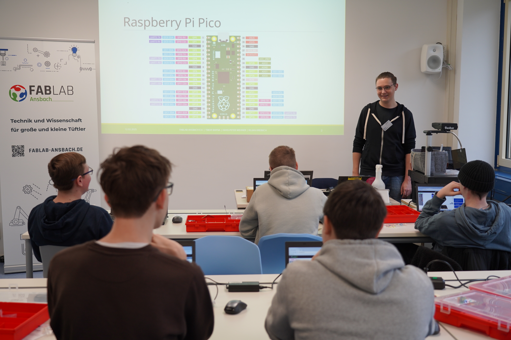
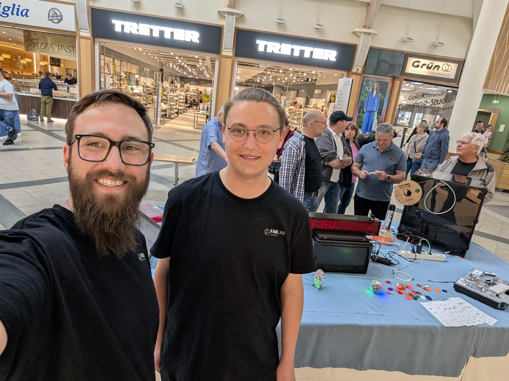
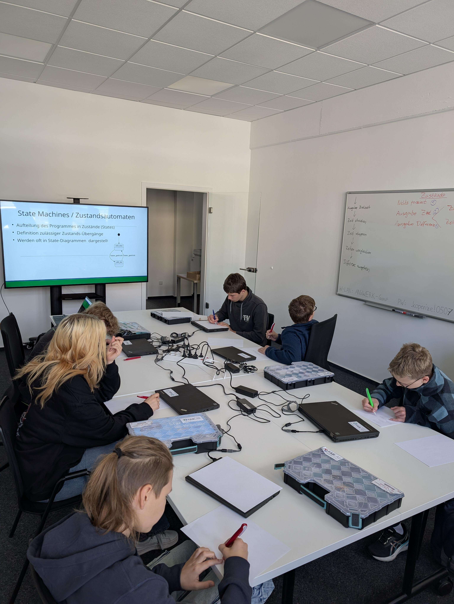
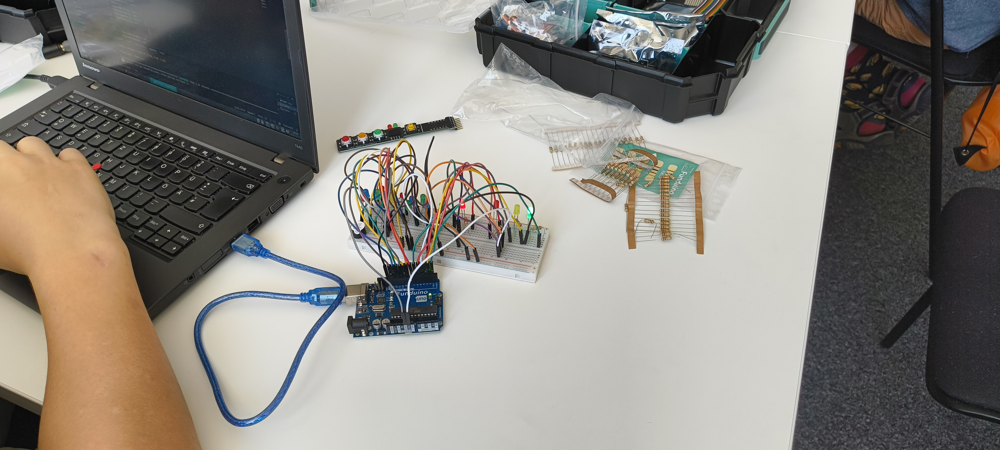
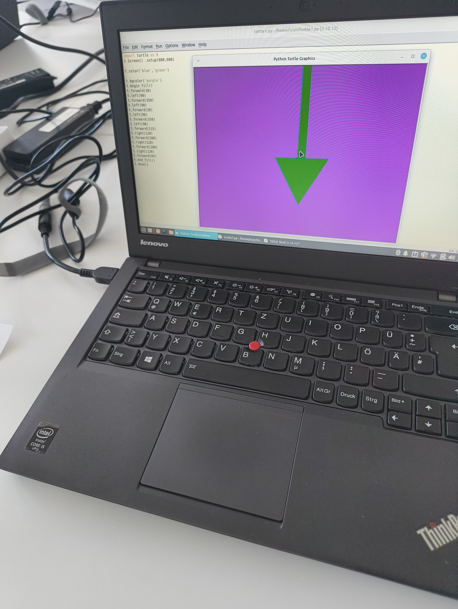
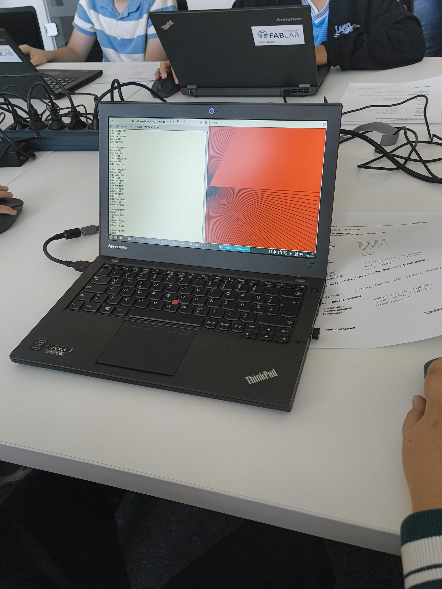
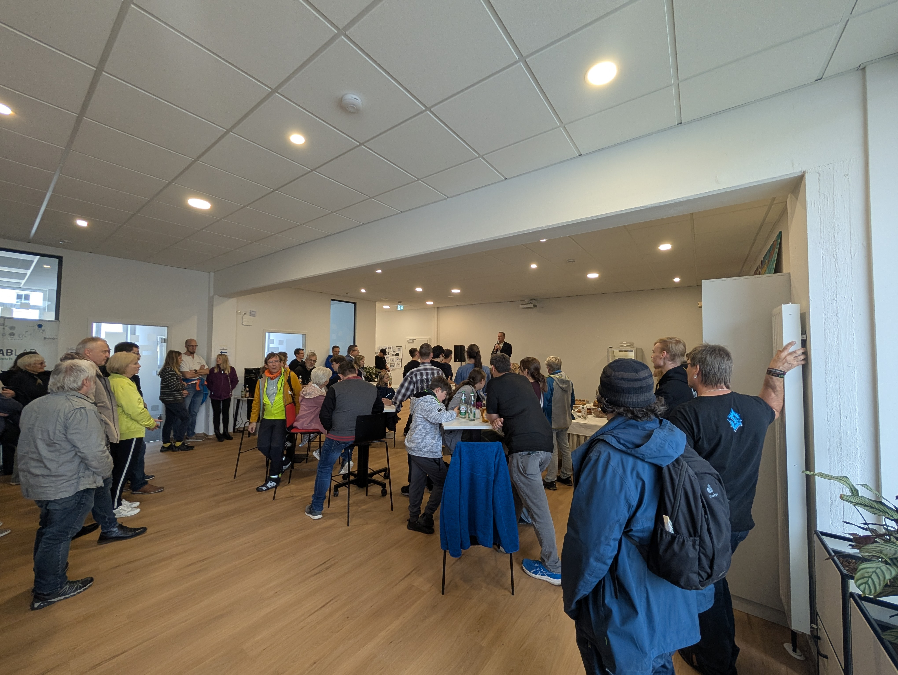
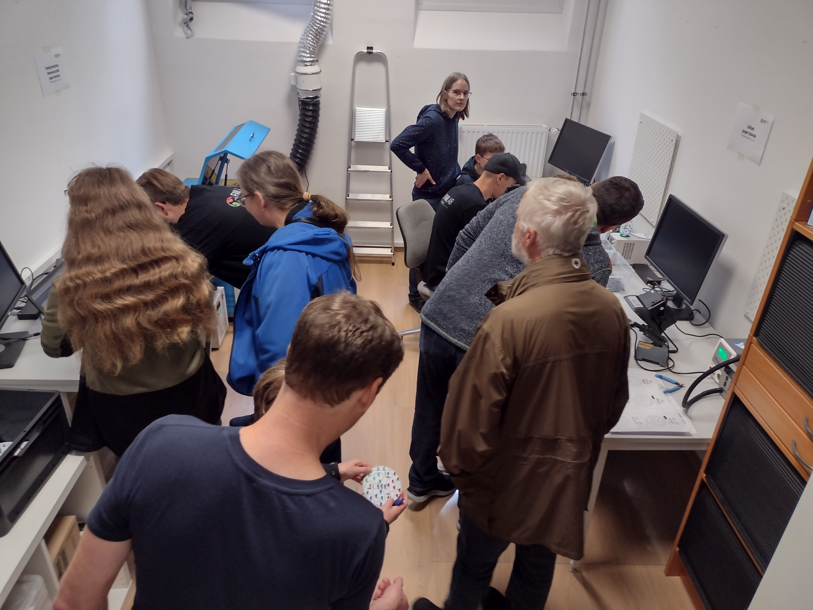
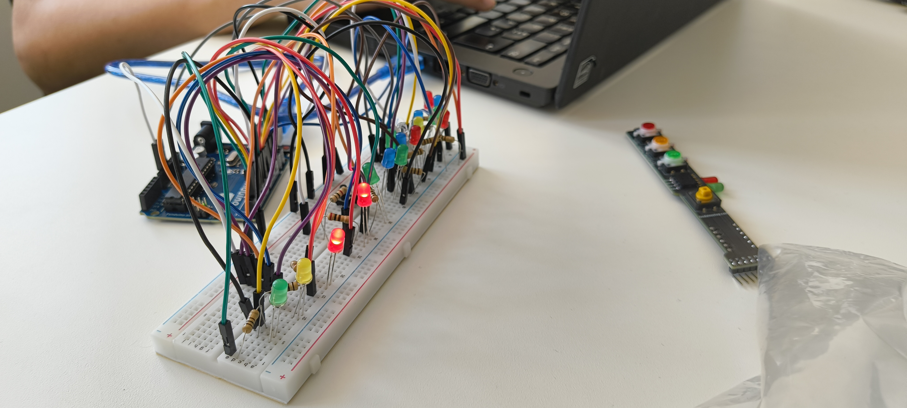

---
# Metadata
author: FabLab Ansbach e.V.
info: FabLab Ansbach e.V. 2026
date: 17.01.2026
title: TOP1 - Begrüßung und Eröffnung
# Config
theme: neversink
color: green-light
transition: slide-left
mdc: true
layout: cover
drawings:
  persist: false
class: text-center
defaults:
  slide_info: false
  slides_link: https://fablab-ansbach.github.io/mitgliederversammlung-2026
  slides_link_noproto: fablab-ansbach.github.io/mitgliederversammlung-2026
---
# Mitgliederversammlung 2026
FabLab Ansbach e.V.

  <QRCode :value="$frontmatter.slides_link" :size="120" render-as="svg" />
  

<a :href="$frontmatter.slides_link">{{ $frontmatter.slides_link_noproto }}</a>

---
title: TOP2 - Festlegung der Tagesordnung
---
# Tagesordnung
 
<Toc minDepth="1" maxDepth=1></Toc>

---
---
# TOP3 - Tätigkeitsbericht, Rückblick und Ausblick
 
<Toc minDepth="2" maxDepth="2"></Toc>

---
level: 2
layout: section
---
# Tätigkeitsbericht und Rückblick

2025 war ein starkes Jahr für unseren Verein!

---
level: 3
---

# Mittelschule Bechofen im FabLab
## Februar

---
level: 3
---

# Das FabLab im Brückencenter

## Mai

---
level: 3
layout: two-cols-header
---

# Arduino Kurse

## Juni und Juli

::left::

### Fortgeschrittene

::right::

### Anfänger

---
level: 3
layout: two-cols-header
---

# Ferienprogramm

## September

::left::

::right::

---
level: 3
---

# Ausstattung des Raums im ANsWERK  & Eröffnung

  

    
    
  

  

    
    
  

---
level: 3
---

# Hack&Make
## November

---
level: 3
---

# Code Week 2025
## November

---
level: 3
---

# Stammtisch und OpenLab

* Stammtisch wurde ab Juli durch OpenLab ersetzt
* Seit November auch guter Anklang bei Externen
* OpenLab ist gut repräsentiert in der Presse

Mitgliederabend:

* Wenig Angeboten, noch weniger genutzt

---
level: 2
layout: section
---

# Ausblick

2026 wird noch besser!

---
level: 3
---

# Regelmäßige Veranstaltungen

* Beibehalten:
  * OpenLab
    * Neu: 14-tägig statt am 2. und 4. Do
  * Mitgliederabend: Nach Bedarf
* Neu:
  * KidsLab
    * Planungstreffen im Januar
    * Einmal im Monat

---
level: 3
---

# Kurse

---
level: 3
---
# Weiteres

* BrückenCenter
* Messe Hack&Make
* Weihnachtsfeier

---
---
# TOP4 - Kassenbericht durch den Kassier

---
---
# TOP5 - Bericht der Kassenprüfer und Entlastung des Vorstands

---
---
# TOP6 - Beschluss über Änderung der Beitragsordnung

---
level: 2
---
# Test2

---
---
# TOP7 - Beschluss über Änderung der Schlüsselordnung

---
---
# TOP8 - Prüfung der aktuellen Preisliste

---
---
# TOP9 - Weitere Tagesordnungspunkte, Wünsche und Anträge